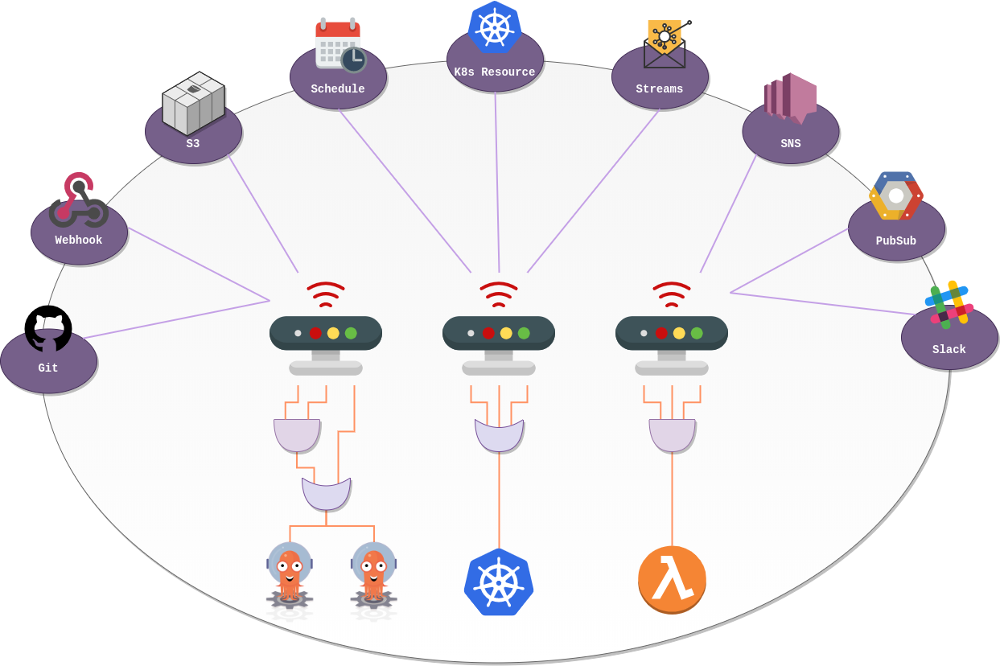

import Button from "../components/button"

## What is Argo Events?

Argo Events is an event-based dependency manager for Kubernetes which helps you define multiple dependencies from a variety of event sources like webhook, s3, schedules, streams etc. and trigger Kubernetes objects after successful event dependencies resolution.

## Features

- Manage dependencies from a variety of event sources.
- Ability to customize business-level constraint logic for event dependencies resolution.
- Manage everything from simple, linear, real-time dependencies to complex, multi-source, batch job dependencies.
- Ability to extends framework to add your own event source listener.
- Define arbitrary boolean logic to resolve event dependencies.
- CloudEvents compliant.
- Ability to manage event sources at runtime.

## Documentation

To learn more about Argo Events, go to complete documentation

  <Button
    to="https://argoproj.github.io/argo-events/"
    external
    type="primary"
    label="View Documentation"
    className="w-full mt-8 md:w-auto"
  />

